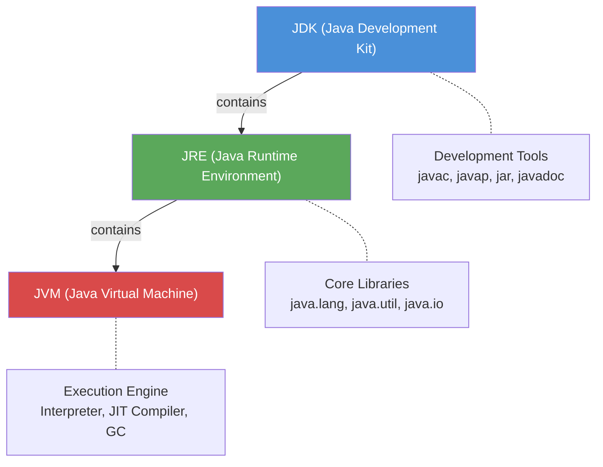
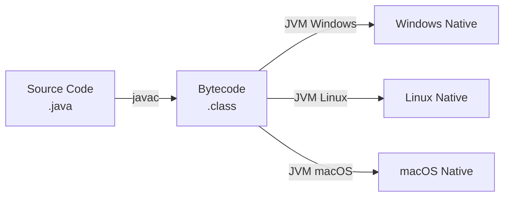
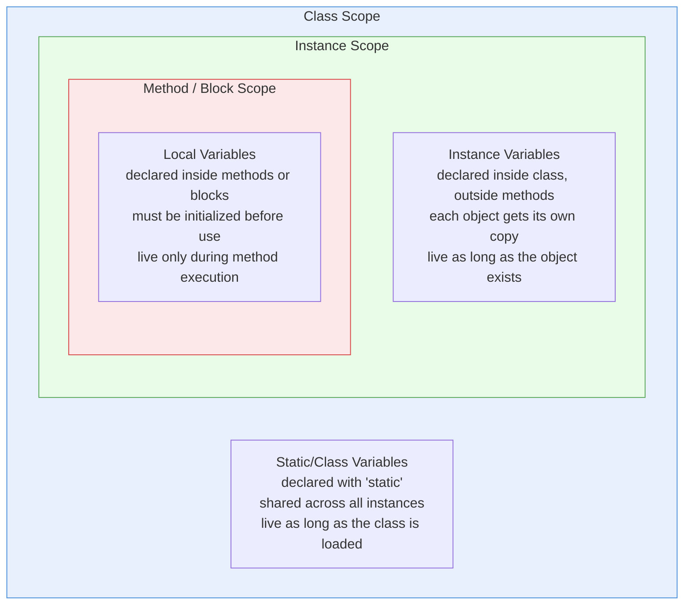

# 01 - Java Basics

## What is Java?

Java is a **high-level, object-oriented, platform-independent** programming language developed by Sun Microsystems (now Oracle). It follows the principle of **"Write Once, Run Anywhere" (WORA)**.

## JDK vs JRE vs JVM

| Component | Full Name | Purpose |
|-----------|-----------|---------|
| **JDK** | Java Development Kit | Full development toolkit (compiler, debugger, tools + JRE) |
| **JRE** | Java Runtime Environment | Runtime libraries + JVM needed to run Java programs |
| **JVM** | Java Virtual Machine | Executes bytecode on the host machine |



## Platform Independence and Bytecode

Java source code (`.java`) is compiled by `javac` into **bytecode** (`.class` files). Bytecode is not native machine code -- it is an intermediate representation that any JVM can interpret or JIT-compile into native instructions.



This is why Java is platform-independent at the source level but platform-dependent at the JVM level (each OS needs its own JVM).

## Class Structure

A Java source file follows a strict structure:

```java
// 1. Package declaration (optional, must be first statement)
package com.oca.datatypes;

// 2. Import statements (optional, after package)
import java.util.List;
import java.util.ArrayList;

// 3. Class declaration (required, at most one public class per file)
public class MyClass {

    // 4. Instance variables (fields)
    private int count;

    // 5. Main method (entry point, required to run the class)
    public static void main(String[] args) {
        System.out.println("Hello, OCA!");
    }

    // 6. Other methods
    public int getCount() {
        return count;
    }
}
```

**Key exam rules:**
- A file can have **at most one public class**, and the filename must match that class name.
- If there is no public class, the filename can be anything.
- The `package` statement, if present, must be the **first non-comment** line.
- `import` statements come **after** the package and **before** the class declaration.

## Variable Scopes



| Scope | Default Value | Needs Explicit Init? | Accessible Via |
|-------|--------------|----------------------|----------------|
| **Static/Class** | Yes (0, null, false) | No | `ClassName.var` or `this.var` |
| **Instance** | Yes (0, null, false) | No | `objectRef.var` or `this.var` |
| **Local** | None | **Yes** (compiler error otherwise) | Directly by name |

**Exam trap:** Local variables have **no default value**. Using an uninitialized local variable causes a **compilation error**, not a runtime error.

## Comments

```java
// Single-line comment: everything after // on this line is ignored

/*
 * Multi-line comment:
 * spans multiple lines
 * cannot be nested
 */

/**
 * Javadoc comment:
 * used by the javadoc tool to generate API documentation.
 * @param args command-line arguments
 * @return nothing
 */
```

- Comments **do not nest**. A `/*` inside another `/* ... */` block does not start a new comment.
- Javadoc comments (`/** ... */`) must appear **immediately before** a class, method, or field declaration to be picked up by the `javadoc` tool.

## Related Source Files

- [DataTypes.java](../com/oca/datatypes/DataTypes.java) -- demonstrates primitive types, declarations, and initialization
- [Dog.java](../com/oca/oops/classes/Dog.java) -- example of class structure with fields and methods
