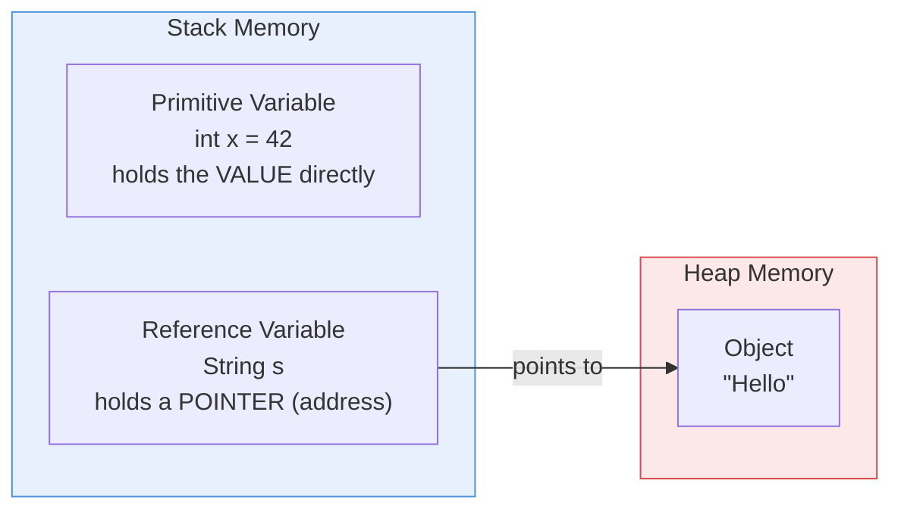
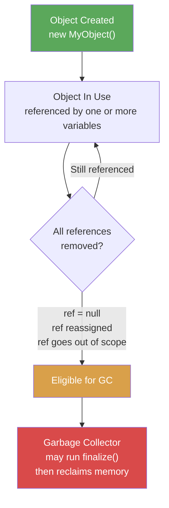
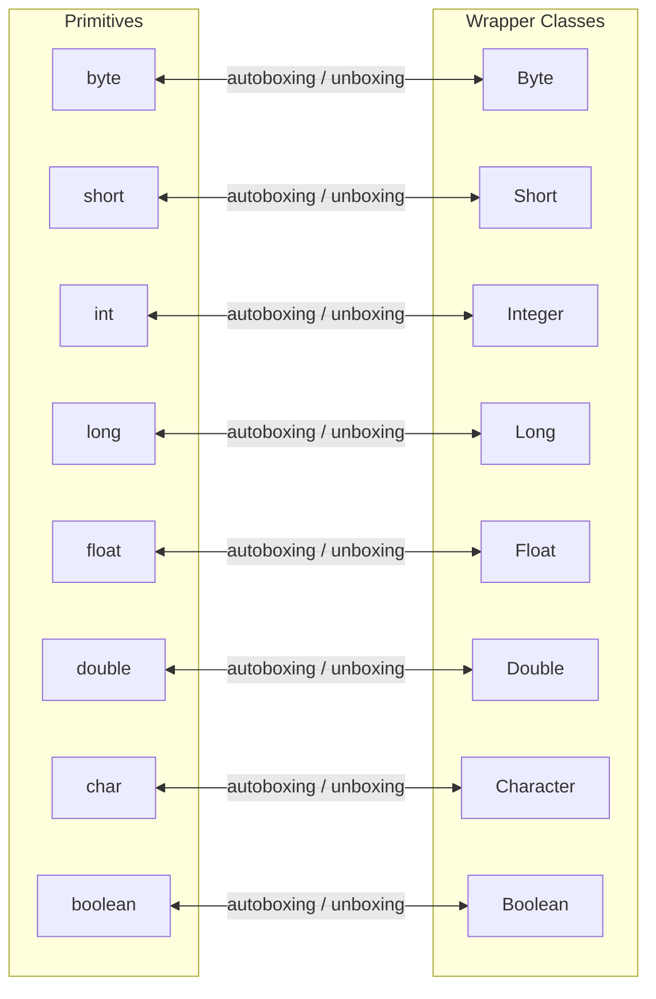

# 02 - Working with Java Data Types

## The 8 Primitive Types

| Type | Size (bits) | Default | Min Value | Max Value | Example |
|------|------------|---------|-----------|-----------|---------|
| `byte` | 8 | 0 | -128 | 127 | `byte b = 100;` |
| `short` | 16 | 0 | -32,768 | 32,767 | `short s = 30000;` |
| `int` | 32 | 0 | -2^31 | 2^31 - 1 | `int i = 100000;` |
| `long` | 64 | 0L | -2^63 | 2^63 - 1 | `long l = 100L;` |
| `float` | 32 | 0.0f | ~1.4E-45 | ~3.4E+38 | `float f = 3.14f;` |
| `double` | 64 | 0.0d | ~4.9E-324 | ~1.8E+308 | `double d = 3.14;` |
| `char` | 16 | '\u0000' | 0 | 65,535 | `char c = 'A';` |
| `boolean` | JVM-specific | false | false | true | `boolean b = true;` |

**Key exam points:**
- `long` literals need the `L` suffix (e.g., `123L`). Lowercase `l` is legal but discouraged (looks like `1`).
- `float` literals need the `f` suffix (e.g., `3.14f`). Without it, `3.14` is a `double`.
- `char` is **unsigned** -- it holds values 0 to 65,535 (Unicode characters).
- Underscores are allowed in numeric literals for readability: `1_000_000`. They cannot appear at the start, end, or adjacent to a decimal point.

## Primitive vs Reference Types



| Feature | Primitive | Reference |
|---------|-----------|-----------|
| Stores | Actual value | Address of object on heap |
| Default value | 0, false, '\u0000' | `null` |
| Can call methods? | No | Yes |
| Can be `null`? | No | Yes |
| Stored in | Stack (local) or heap (field) | Pointer on stack, object on heap |

## Variable Declaration and Initialization

```java
// Declaration only
int count;

// Declaration with initialization
int count = 10;

// Multiple declarations (same type)
int a, b, c;            // all are int
int x = 1, y = 2;       // both initialized
int m, n = 5;            // m is declared (not initialized), n = 5

// Exam trap: this does NOT compile
// int a, long b;        // cannot mix types in one statement
```

## Default Values

Only **instance** and **static** variables get default values. **Local variables** do not.

| Type | Default Value |
|------|--------------|
| `byte`, `short`, `int`, `long` | 0 |
| `float`, `double` | 0.0 |
| `char` | '\u0000' (null character) |
| `boolean` | false |
| Object references | null |

## Object Lifecycle



**Ways an object becomes eligible for garbage collection:**
1. Setting all references to `null`
2. Reassigning the reference to another object
3. The reference goes out of scope (method returns)
4. **Island of isolation** -- objects reference each other but nothing external references them

**Exam points:**
- You **cannot force** garbage collection. `System.gc()` is only a suggestion.
- The `finalize()` method is called **at most once** per object, and only if the GC decides to collect it.
- An object in `finalize()` can "resurrect" itself by creating a new reference to itself.

## Wrapper Classes

Every primitive has a corresponding **wrapper class** in `java.lang`:



### Autoboxing and Unboxing

```java
// Autoboxing: primitive -> wrapper (automatic)
Integer wrapped = 42;          // compiler does: Integer.valueOf(42)

// Unboxing: wrapper -> primitive (automatic)
int unwrapped = wrapped;       // compiler does: wrapped.intValue()

// Danger: unboxing null throws NullPointerException
Integer nullRef = null;
int crash = nullRef;            // NullPointerException at runtime!
```

### Integer Cache (-128 to 127) -- Important Exam Trap

Java caches `Integer` objects for values in the range **-128 to 127**. This means `==` comparison may give surprising results:

```java
Integer a = 127;
Integer b = 127;
System.out.println(a == b);      // true  (same cached object)

Integer c = 128;
Integer d = 128;
System.out.println(c == d);      // false (different objects!)

System.out.println(c.equals(d)); // true  (always compares values)
```

**Rule:** Always use `.equals()` for comparing wrapper objects. The `==` operator compares **references**, not values (except when the cache kicks in).

The cache also applies to `Byte`, `Short`, `Long`, and `Character` (for values 0-127).

## String Pool Concept

String literals are stored in a special area of the heap called the **String Pool** (or intern pool). When you create a string literal, Java checks the pool first:

```java
String s1 = "hello";           // created in string pool
String s2 = "hello";           // reuses same object from pool
String s3 = new String("hello"); // new object on heap, NOT in pool

System.out.println(s1 == s2);    // true  (same pool reference)
System.out.println(s1 == s3);    // false (different objects)
System.out.println(s1.equals(s3)); // true (same content)

String s4 = s3.intern();        // explicitly adds to pool / returns pool ref
System.out.println(s1 == s4);    // true
```

## Related Source Files

- [DataTypes.java](../com/oca/datatypes/DataTypes.java) -- primitive type declarations and usage
- [WrapperClasses.java](../com/oca/wrapperclasses/WrapperClasses.java) -- autoboxing, unboxing, and Integer cache demos
- [ObjectLifecycle.java](../com/oca/objectlifecycle/ObjectLifecycle.java) -- object creation and GC eligibility examples
