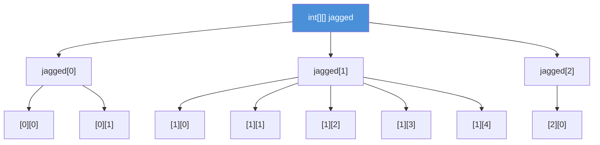
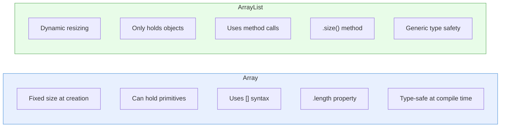

# 04 - Creating and Using Arrays

## Array Declaration, Instantiation, and Initialization

### All Valid Syntax Forms

```java
// Declaration (bracket position is flexible)
int[] nums;          // preferred
int nums2[];         // also valid (C-style)
int[] nums3, nums4;  // both are int arrays
int nums5[], nums6;  // nums5 is int[], nums6 is just int!

// Instantiation (creates the array with a fixed size)
int[] nums = new int[5];        // 5 elements, all default to 0

// Initialization (inline, size is inferred)
int[] nums = new int[]{1, 2, 3, 4, 5};

// Anonymous array (shortcut, only at declaration)
int[] nums = {1, 2, 3, 4, 5};   // valid only in declaration statement

// NOT valid after declaration:
// int[] nums;
// nums = {1, 2, 3};    // DOES NOT COMPILE
// nums = new int[]{1, 2, 3};  // this works
```

**Exam trap:** The bracket placement in declarations matters when declaring multiple variables on one line. `int[] a, b;` declares two arrays, but `int a[], b;` declares one array and one int.

## Default Values in Arrays

When an array is created with `new`, all elements are initialized to their type's default value:

| Element Type | Default Value |
|-------------|--------------|
| `byte`, `short`, `int`, `long` | 0 |
| `float`, `double` | 0.0 |
| `char` | '\u0000' |
| `boolean` | false |
| Object references | null |

## Multi-Dimensional Arrays

### Rectangular Arrays

```java
// 3 rows, 4 columns -- all rows have same length
int[][] matrix = new int[3][4];

// Access
matrix[0][0] = 1;
matrix[2][3] = 12;
```

### Jagged (Ragged) Arrays

```java
// Only the first dimension is required
int[][] jagged = new int[3][];    // 3 rows, columns not yet defined
jagged[0] = new int[2];           // row 0 has 2 columns
jagged[1] = new int[5];           // row 1 has 5 columns
jagged[2] = new int[1];           // row 2 has 1 column

// Inline initialization
int[][] jagged2 = {
    {1, 2},
    {3, 4, 5, 6, 7},
    {8}
};
```



## Common Operations and Pitfalls

```java
int[] arr = {10, 20, 30, 40, 50};

// Length (property, not method -- no parentheses)
arr.length;    // 5

// Access elements (0-indexed)
arr[0];        // 10 (first element)
arr[4];        // 50 (last element)
arr[5];        // ArrayIndexOutOfBoundsException! (runtime)
arr[-1];       // ArrayIndexOutOfBoundsException! (runtime)

// Sorting
java.util.Arrays.sort(arr);

// Searching (array MUST be sorted first)
java.util.Arrays.binarySearch(arr, 30);  // returns index

// Converting to String
java.util.Arrays.toString(arr);  // "[10, 20, 30, 40, 50]"
```

**`ArrayIndexOutOfBoundsException`** is a **runtime** exception (unchecked). It is thrown when you access an index that is negative or >= array length. The compiler cannot catch this.

## ArrayList

`ArrayList` is a resizable array implementation from `java.util`. Unlike arrays, it can grow and shrink dynamically.

### Declaration and Common Operations

```java
import java.util.ArrayList;

// Declaration (prefer the diamond operator <>)
ArrayList<String> list = new ArrayList<>();

// Add elements
list.add("Alpha");              // adds to end -> [Alpha]
list.add("Beta");               // adds to end -> [Alpha, Beta]
list.add(0, "Zero");            // inserts at index 0 -> [Zero, Alpha, Beta]

// Access
list.get(0);                    // "Zero"
list.get(3);                    // IndexOutOfBoundsException!

// Modify
list.set(1, "A");               // replaces index 1 -> [Zero, A, Beta]

// Remove
list.remove(0);                 // removes by index -> [A, Beta]
list.remove("Beta");            // removes by object -> [A]

// Query
list.size();                    // 1
list.isEmpty();                 // false
list.contains("A");             // true
list.indexOf("A");              // 0
```

### ArrayList vs Array



| Feature | Array | ArrayList |
|---------|-------|-----------|
| Size | Fixed | Dynamic |
| Primitives | Yes | No (uses wrappers) |
| Length | `.length` (property) | `.size()` (method) |
| Access | `arr[i]` | `list.get(i)` |
| Type safety | Built-in | Generics |
| Performance | Faster (no overhead) | Slightly slower |
| Dimension | Multi-dimensional | Single only (but can nest) |

### Autoboxing with ArrayList

Since `ArrayList` cannot hold primitives, Java autoboxes them:

```java
ArrayList<Integer> numbers = new ArrayList<>();
numbers.add(42);          // autoboxing: int 42 -> Integer.valueOf(42)
int val = numbers.get(0); // unboxing: Integer -> int

// Exam trap: remove() ambiguity
numbers.add(1);
numbers.add(2);
numbers.add(3);
numbers.remove(1);        // removes element at INDEX 1 (not the value 1!)
numbers.remove(Integer.valueOf(1)); // removes the OBJECT with value 1
```

### Converting Between Array and ArrayList

```java
// ArrayList -> Array
ArrayList<String> list = new ArrayList<>();
list.add("a");
list.add("b");
String[] arr = list.toArray(new String[0]);

// Array -> List (returns fixed-size list backed by the array)
String[] arr2 = {"x", "y", "z"};
List<String> fixedList = Arrays.asList(arr2);
// fixedList.add("w");  // UnsupportedOperationException!
// fixedList.set(0, "a"); // OK, also modifies arr2

// For a truly independent ArrayList:
ArrayList<String> mutableList = new ArrayList<>(Arrays.asList(arr2));
```

## Related Source Files

- [ArraysExample.java](../com/oca/arrays/ArraysExample.java) -- array declaration, multi-dimensional arrays, and operations
- [CollectionsExample.java](../com/oca/collections/CollectionsExample.java) -- ArrayList usage and common operations
