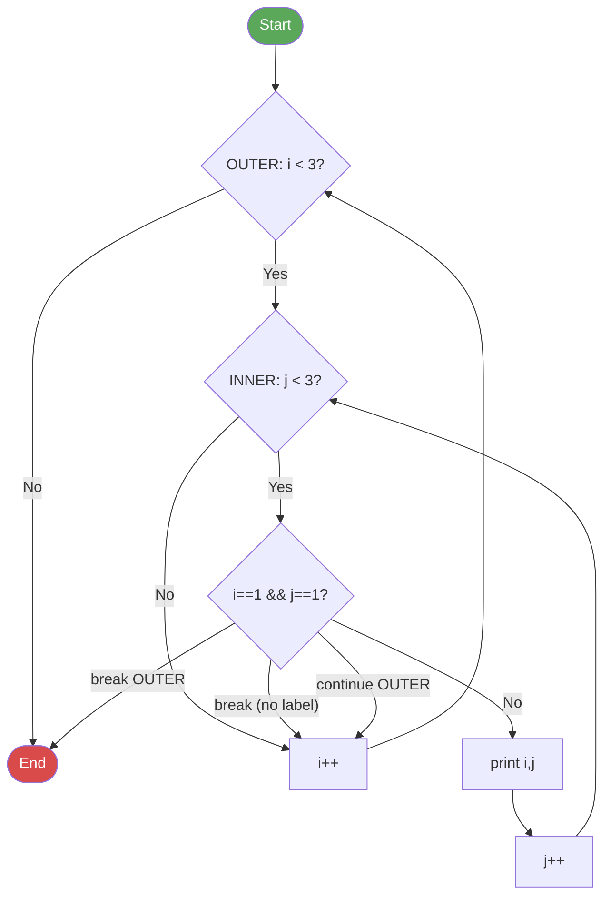

# 05 - Using Loop Constructs

## for Loop (Standard)

```java
for (initialization; condition; update) {
    // body
}
```

```java
for (int i = 0; i < 5; i++) {
    System.out.println(i);  // 0, 1, 2, 3, 4
}
```

**Exam details:**
- All three sections (init, condition, update) are **optional**: `for (;;)` is an infinite loop.
- The initialization can declare multiple variables of the **same type**: `for (int i = 0, j = 10; i < j; i++, j--)`.
- The update section can have multiple expressions separated by commas.
- The condition must evaluate to a `boolean` (or be empty).

```java
// Multiple variables and updates
for (int i = 0, j = 10; i < j; i++, j--) {
    System.out.println(i + " " + j);
}

// Exam trap: this does NOT compile (different types)
// for (int i = 0, long j = 10; ...) { }
```

## Enhanced for-each Loop

```java
for (ElementType element : collection) {
    // body
}
```

```java
int[] nums = {10, 20, 30};
for (int n : nums) {
    System.out.println(n);  // 10, 20, 30
}

ArrayList<String> names = new ArrayList<>();
names.add("Alice");
names.add("Bob");
for (String name : names) {
    System.out.println(name);
}
```

**Exam points:**
- Works with **arrays** and any class implementing `java.lang.Iterable` (e.g., `ArrayList`, `LinkedList`).
- You **cannot** modify the collection's structure during iteration (no add/remove) -- causes `ConcurrentModificationException`.
- The loop variable is a **copy**. Assigning to it does not change the original array/collection element.
- You **cannot** access the index directly with for-each.

## while Loop

```java
while (condition) {
    // body executes zero or more times
}
```

```java
int count = 0;
while (count < 3) {
    System.out.println(count);  // 0, 1, 2
    count++;
}
```

The condition is checked **before** each iteration. If `false` initially, the body never executes.

## do-while Loop

```java
do {
    // body executes at least once
} while (condition);   // note the semicolon!
```

```java
int count = 10;
do {
    System.out.println(count);  // prints 10 (executes once even though condition is false)
    count++;
} while (count < 3);
```

**Key difference from `while`:** The body executes **at least once**, because the condition is checked **after** the first iteration.

**Exam trap:** The semicolon after `while (condition);` is **required** in a do-while loop. Forgetting it is a compilation error.

## break and continue

| Statement | Effect |
|-----------|--------|
| `break` | Immediately **exits** the innermost loop or switch |
| `continue` | **Skips** the rest of the current iteration and jumps to the next iteration |

```java
// break: stop when we find 3
for (int i = 0; i < 10; i++) {
    if (i == 3) break;
    System.out.println(i);  // 0, 1, 2
}

// continue: skip even numbers
for (int i = 0; i < 6; i++) {
    if (i % 2 == 0) continue;
    System.out.println(i);  // 1, 3, 5
}
```

## Labeled Loops

Labels allow `break` and `continue` to target an **outer** loop, not just the innermost one.

```java
OUTER: for (int i = 0; i < 3; i++) {
    INNER: for (int j = 0; j < 3; j++) {
        if (i == 1 && j == 1) {
            break OUTER;       // exits BOTH loops
            // break;          // would only exit the inner loop
            // continue OUTER; // would skip to the next iteration of the outer loop
        }
        System.out.println(i + "," + j);
    }
}
// Output: 0,0  0,1  0,2  1,0
```

### Control Flow with Labels



**Exam rules for labels:**
- A label is an identifier followed by a colon: `LABEL_NAME:`.
- `break LABEL` exits the labeled statement entirely.
- `continue LABEL` skips to the next iteration of the labeled loop.
- Labels can be applied to any statement, but `continue LABEL` only makes sense with loops.

## Nested Loops

```java
// Multiplication table
for (int i = 1; i <= 3; i++) {
    for (int j = 1; j <= 3; j++) {
        System.out.print(i * j + "\t");
    }
    System.out.println();
}
// 1  2  3
// 2  4  6
// 3  6  9
```

## Common Exam Traps

### 1. Infinite Loops

```java
// Obvious infinite loop
while (true) { }

// Subtle infinite loop: forgetting to update the variable
int i = 0;
while (i < 10) {
    System.out.println(i);
    // forgot i++ -> runs forever
}

// for loop with no update
for (int x = 0; x < 5; ) {
    System.out.println(x);
    // x never changes -> infinite loop
}
```

### 2. Off-by-One Errors

```java
int[] arr = {1, 2, 3, 4, 5};

// Correct: 0 to length-1
for (int i = 0; i < arr.length; i++) { }

// Off-by-one: <= causes ArrayIndexOutOfBoundsException
for (int i = 0; i <= arr.length; i++) {
    System.out.println(arr[i]);  // crashes when i == 5
}
```

### 3. do-while Executes At Least Once

```java
boolean condition = false;

// while: body never executes
while (condition) {
    System.out.println("while");  // never printed
}

// do-while: body executes once
do {
    System.out.println("do-while");  // printed once!
} while (condition);
```

### 4. Unreachable Code

```java
// Compilation error: unreachable statement
while (false) {
    System.out.println("unreachable");  // DOES NOT COMPILE
}

// But this compiles (compiler doesn't analyze variable values):
boolean b = false;
while (b) {
    System.out.println("compiles but never runs");  // COMPILES
}
```

### 5. Variable Scope in Loops

```java
for (int i = 0; i < 5; i++) {
    int x = i * 2;
}
// System.out.println(i);  // DOES NOT COMPILE: i is out of scope
// System.out.println(x);  // DOES NOT COMPILE: x is out of scope
```

## Related Source Files

- [ControlFlow.java](../com/oca/controlflow/ControlFlow.java) -- for, while, do-while, break, and continue examples
- [LabeledLoops.java](../com/oca/controlflow/LabeledLoops.java) -- labeled break and continue demonstrations
