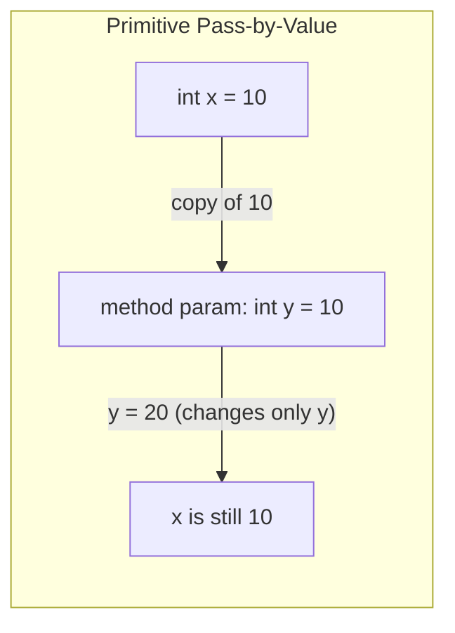
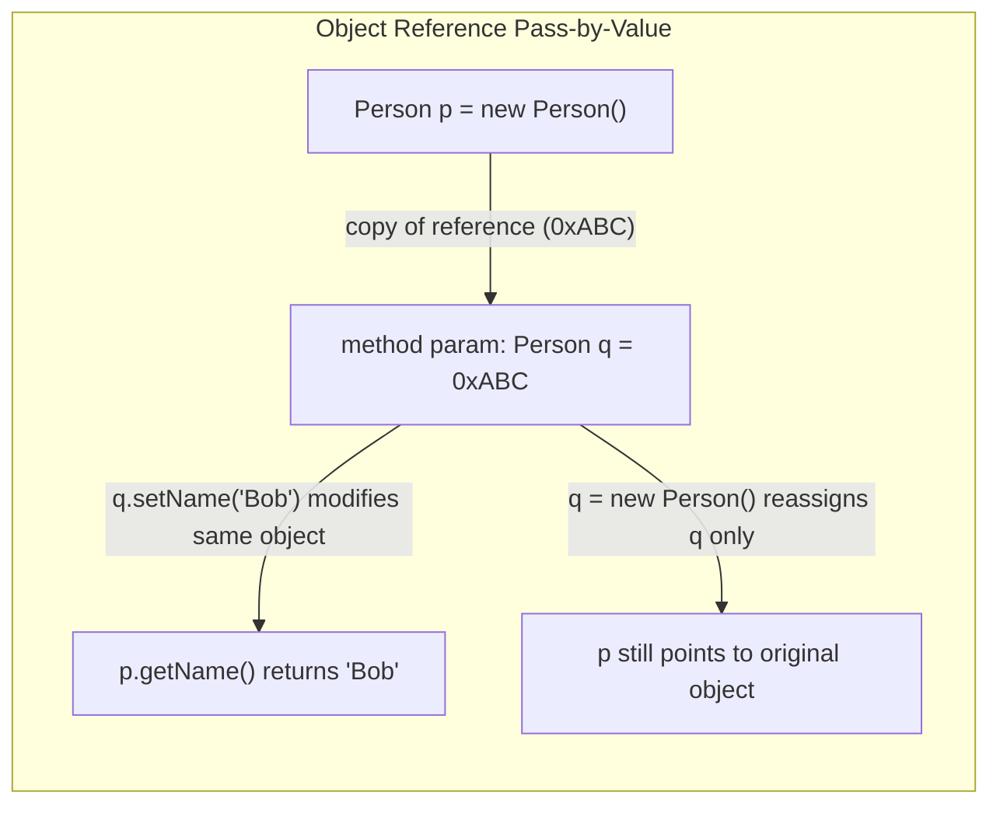
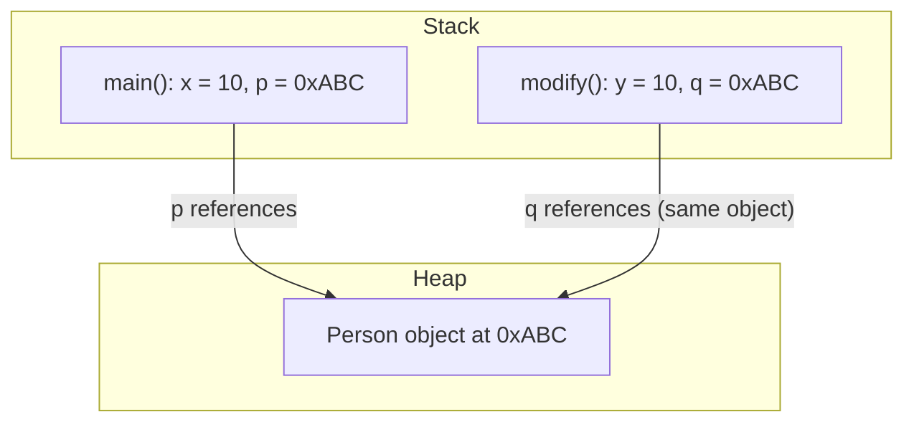
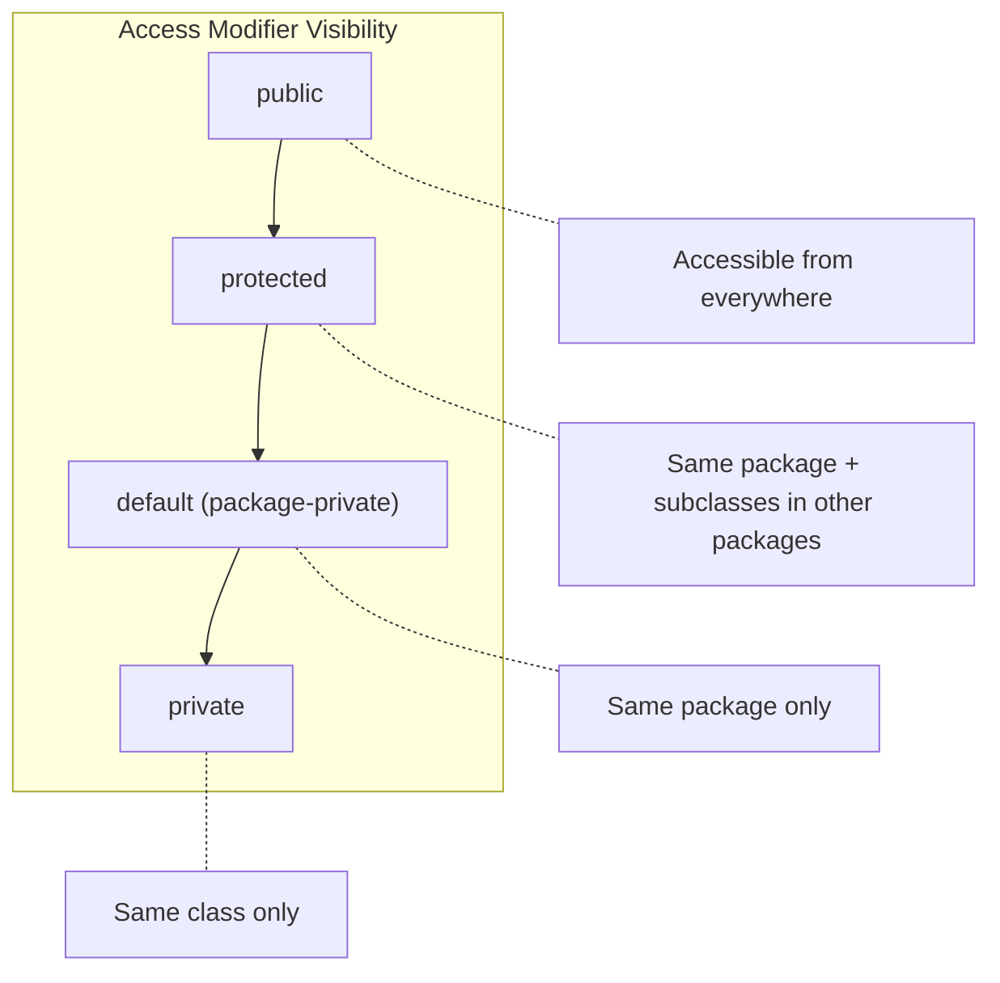

# 06 - Working with Methods and Encapsulation

## Method Signatures

Every Java method has a signature composed of the following parts (in order):

```
[access modifier] [optional: static/final/abstract] [return type] [method name]([parameters]) [throws clause]
```

Example:

```java
public static int calculateSum(int a, int b) throws ArithmeticException {
    return a + b;
}
```

**Key rules for the OCA exam:**

- The return type is **not** part of the method signature for overloading purposes -- only the method name and parameter list matter.
- A method must declare a return type. If it returns nothing, use `void`.
- The parameter list can be empty, but parentheses are still required.
- Varargs (`int... nums`) must be the **last** parameter and there can be only one per method.

---

## Method Overloading

Method overloading means defining multiple methods with the **same name** but **different parameter lists** in the same class.

**Rules:**

| Aspect | Can Differ? |
|---|---|
| Number of parameters | Yes |
| Type of parameters | Yes |
| Order of parameter types | Yes |
| Return type only | No (compile error if only return type differs) |
| Access modifier only | No (not sufficient to distinguish) |

```java
public int add(int a, int b) { return a + b; }
public double add(double a, double b) { return a + b; }   // valid overload
public int add(int a, int b, int c) { return a + b + c; } // valid overload
```

**Overloading resolution order:** exact match > widening > autoboxing > varargs.

---

## Pass-by-Value Semantics

Java is **always pass-by-value**. There is no pass-by-reference. However, when passing objects, the **value of the reference** (the memory address) is copied.







**Key takeaway:** Reassigning a reference parameter inside a method does **not** affect the original reference in the caller. Modifying the object's internal state through the reference **does** affect the original object.

See: [`../com/oca/passbyvalue/PassByValue.java`](../com/oca/passbyvalue/PassByValue.java)

---

## Constructors

### Default Constructor

- If no constructor is explicitly defined, the compiler provides a **no-argument default constructor**.
- If any constructor is defined, the default constructor is **not** generated automatically.

### Parameterized Constructor

```java
public class Person {
    private String name;
    public Person(String name) {
        this.name = name;
    }
}
```

### Constructor Chaining

Use `this()` to call another constructor in the **same class** and `super()` to call a constructor in the **parent class**.

```java
public class Person {
    private String name;
    private int age;

    public Person() {
        this("Unknown", 0);  // must be first statement
    }

    public Person(String name, int age) {
        super();              // implicit if not specified
        this.name = name;
        this.age = age;
    }
}
```

**Rules:**
- `this()` or `super()` must be the **first statement** in the constructor.
- You cannot use both `this()` and `super()` in the same constructor.
- If neither is specified, the compiler inserts `super()` automatically.
- Constructors are **not** inherited.

---

## The `static` Keyword

### Static Fields

- Belong to the **class**, not to any instance.
- Shared across all instances.
- Can be accessed using the class name: `ClassName.staticField`.

### Static Methods

- Can be called without creating an instance.
- Cannot access instance variables or instance methods directly.
- Cannot use `this` or `super`.

### Static Initializers

```java
public class Config {
    static int value;
    static {
        value = loadFromFile();  // runs when class is loaded
    }
}
```

- Static initializer blocks run in order of appearance when the class is first loaded.
- They run before any constructor.

See: [`../com/oca/statics/StaticExample.java`](../com/oca/statics/StaticExample.java)

---

## The `final` Keyword

| Applied To | Effect |
|---|---|
| Variable (primitive) | Value cannot be changed after initialization |
| Variable (reference) | Reference cannot point to a different object (but the object's contents can change) |
| Method | Cannot be overridden in a subclass |
| Class | Cannot be extended (no subclasses allowed) |

```java
final int x = 10;
// x = 20;  // compile error

final List<String> list = new ArrayList<>();
list.add("allowed");    // modifying contents is fine
// list = new ArrayList<>();  // compile error -- cannot reassign

final class ImmutableClass { }
// class Sub extends ImmutableClass { }  // compile error
```

**Blank final variables** must be initialized exactly once -- either inline, in an instance initializer block, or in every constructor.

See: [`../com/oca/finalkeyword/FinalKeywordExample.java`](../com/oca/finalkeyword/FinalKeywordExample.java)

---

## Access Modifiers

Java has four levels of access control:

| Modifier | Same Class | Same Package | Subclass (different package) | Any Class |
|---|---|---|---|---|
| `private` | Yes | No | No | No |
| default (no keyword) | Yes | Yes | No | No |
| `protected` | Yes | Yes | Yes | No |
| `public` | Yes | Yes | Yes | Yes |



**Exam traps:**

- `protected` does **not** mean "accessible by subclass only" -- it also includes same-package access.
- Default access (no modifier) is sometimes called "package-private." There is no `default` keyword for access (do not confuse with `default` in interfaces or switch).
- A top-level class can only be `public` or default. It cannot be `private` or `protected`.

---

## Encapsulation

Encapsulation is the practice of hiding internal state and requiring interaction through well-defined methods.

### Implementing Encapsulation

1. Declare instance variables as `private`.
2. Provide `public` getter and setter methods.
3. Perform validation in setters if needed.

```java
public class Person {
    private String name;
    private int age;

    public String getName() { return name; }
    public void setName(String name) { this.name = name; }

    public int getAge() { return age; }
    public void setAge(int age) {
        if (age >= 0) this.age = age;
    }
}
```

### Immutable Objects

To create an immutable object:

1. Declare the class as `final`.
2. Make all fields `private` and `final`.
3. Provide no setter methods.
4. Initialize all fields via the constructor.
5. For mutable fields (like `Date` or `List`), return defensive copies from getters.

```java
public final class ImmutablePerson {
    private final String name;
    private final int age;

    public ImmutablePerson(String name, int age) {
        this.name = name;
        this.age = age;
    }

    public String getName() { return name; }
    public int getAge() { return age; }
}
```

See: [`../com/oca/oops/encapsulation/Person.java`](../com/oca/oops/encapsulation/Person.java)

---

## Source Code References

| Topic | File |
|---|---|
| Pass-by-value | [`PassByValue.java`](../com/oca/passbyvalue/PassByValue.java) |
| Static keyword | [`StaticExample.java`](../com/oca/statics/StaticExample.java) |
| Final keyword | [`FinalKeywordExample.java`](../com/oca/finalkeyword/FinalKeywordExample.java) |
| Encapsulation | [`Person.java`](../com/oca/oops/encapsulation/Person.java) |
