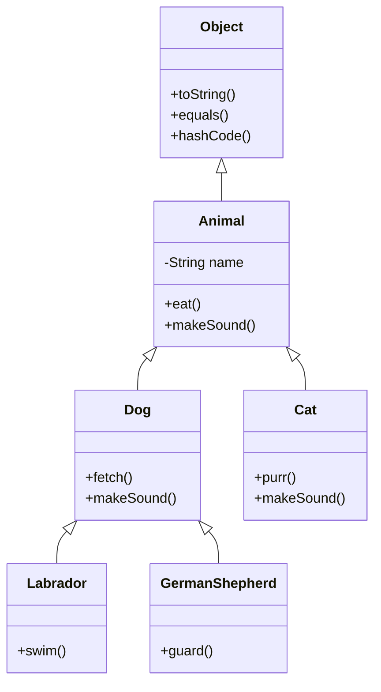
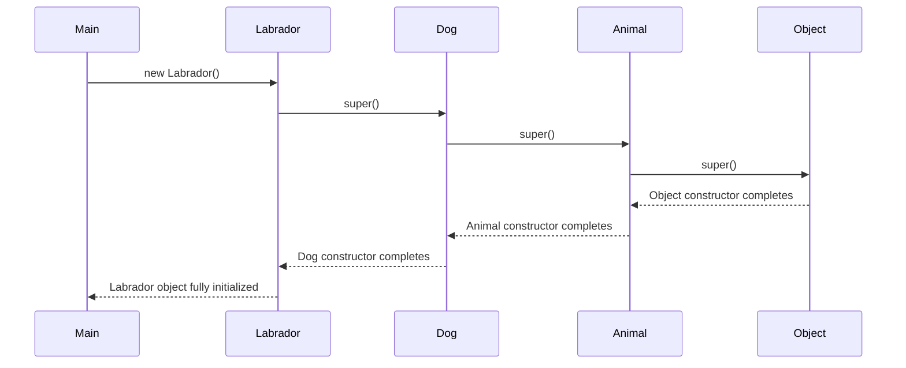
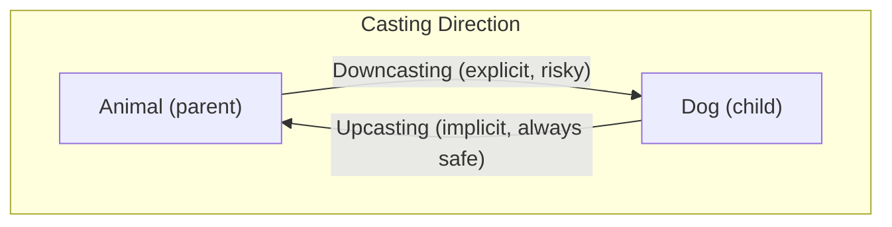

# 07 - Working with Inheritance and Polymorphism

## Inheritance Basics

Inheritance allows a class to acquire the fields and methods of another class using the `extends` keyword. This establishes an **IS-A** relationship.

```java
public class Animal { }
public class Dog extends Animal { }   // Dog IS-A Animal
public class Labrador extends Dog { } // Labrador IS-A Dog, IS-A Animal
```

**Rules:**
- A class can extend only **one** class (no multiple inheritance of classes in Java).
- A class can implement **multiple** interfaces.
- All classes implicitly extend `java.lang.Object` if no explicit superclass is specified.
- `private` members are **not** inherited (not accessible in the subclass).
- Constructors are **not** inherited, but the parent constructor is always invoked.



---

## Method Overriding

A subclass provides its own implementation of a method already defined in its superclass.

**Rules for valid overriding:**

| Rule | Requirement |
|---|---|
| Method name | Must be identical |
| Parameter list | Must be identical |
| Return type | Same type or a **covariant** (subtype) return type |
| Access modifier | Same or **more permissive** (cannot reduce visibility) |
| Exceptions | Cannot throw new or broader checked exceptions |
| `static` methods | Cannot be overridden (they are hidden, not overridden) |
| `final` methods | Cannot be overridden |
| `private` methods | Cannot be overridden (not visible to subclass) |

```java
public class Animal {
    protected Animal create() { return new Animal(); }
}

public class Dog extends Animal {
    @Override
    public Dog create() {  // covariant return type (Dog extends Animal)
        return new Dog();  // access widened from protected to public -- valid
    }
}
```

The `@Override` annotation is optional but highly recommended. The compiler will flag an error if the annotated method does not actually override a superclass method.

---

## The `super` Keyword

- `super.method()` -- calls the parent class version of an overridden method.
- `super.field` -- accesses a parent class field (if shadowed).
- `super()` -- calls a parent class constructor (must be the first statement in a constructor).

```java
public class Dog extends Animal {
    @Override
    public void makeSound() {
        super.makeSound();       // call Animal's makeSound first
        System.out.println("Woof!");
    }
}
```

---

## The `this` Keyword

- `this` refers to the **current instance** of the class.
- `this.field` -- disambiguates between instance variables and parameters.
- `this()` -- calls another constructor in the same class.
- `this` cannot be used in a `static` context.

---

## Constructor Chaining in Inheritance

When a subclass object is created, constructors execute from the **topmost parent down** to the actual class being instantiated.



**Key points:**
- If no explicit `super()` or `this()` call is present, the compiler inserts `super()` (no-arg) as the first statement.
- If the parent class has no no-arg constructor, the subclass **must** explicitly call a parameterized `super(args)`.

---

## Polymorphism

Polymorphism means "many forms." In Java, there are two types:

### Compile-Time Polymorphism (Method Overloading)

The compiler decides which overloaded method to call based on the parameter types at compile time.

```java
public int add(int a, int b) { return a + b; }
public double add(double a, double b) { return a + b; }
```

### Runtime Polymorphism (Method Overriding)

The JVM decides which overridden method to call based on the **actual object type** at runtime.

```java
Animal a = new Dog();   // reference type: Animal, object type: Dog
a.makeSound();          // calls Dog's makeSound() -- determined at runtime
```

---

## Reference Type vs Object Type

This is one of the most important concepts on the OCA exam.

| Aspect | Determined By |
|---|---|
| Which methods can be **called** | Reference type (compile time) |
| Which overridden method **executes** | Object type (runtime) |
| Which **fields** are accessed | Reference type (fields are not polymorphic) |

```java
Animal a = new Dog();
a.makeSound();  // compiles (makeSound is in Animal), runs Dog's version
// a.fetch();   // compile error -- fetch() is not in Animal
```

---

## Upcasting and Downcasting



### Upcasting (Widening)

Assigning a subclass reference to a superclass variable. Always safe, done implicitly.

```java
Dog d = new Dog();
Animal a = d;           // implicit upcast
```

### Downcasting (Narrowing)

Assigning a superclass reference to a subclass variable. Requires an explicit cast and can fail at runtime.

```java
Animal a = new Dog();
Dog d = (Dog) a;        // explicit downcast -- works because actual object IS a Dog

Animal a2 = new Animal();
Dog d2 = (Dog) a2;      // compiles, but throws ClassCastException at runtime
```

---

## The `instanceof` Operator

Used to check whether an object is an instance of a particular class or interface before downcasting.

```java
Animal a = new Dog();

if (a instanceof Dog) {
    Dog d = (Dog) a;    // safe downcast
    d.fetch();
}
```

**Rules:**
- Returns `true` if the object is an instance of the specified type or any of its subtypes.
- Returns `false` if the reference is `null`.
- Compile error if the cast is **impossible** (unrelated types in the class hierarchy).

```java
String s = "hello";
// if (s instanceof Integer) { }  // compile error -- String and Integer are unrelated
```

---

## Abstract Classes vs Interfaces

| Feature | Abstract Class | Interface |
|---|---|---|
| Keyword | `abstract class` | `interface` |
| Can have constructors | Yes | No |
| Can have instance fields | Yes | Only `public static final` constants |
| Can have concrete methods | Yes | Yes (default methods in Java 8) |
| Can have abstract methods | Yes | Yes (all methods are implicitly abstract unless default/static) |
| Can have static methods | Yes | Yes (Java 8+) |
| Multiple inheritance | No (single extends) | Yes (multiple implements) |
| Access modifiers on methods | Any | `public` only (implicitly) |
| When to use | Shared state and behavior among related classes | Define a contract/capability for unrelated classes |

### Abstract Classes

```java
public abstract class Shape {
    private String color;

    public Shape(String color) {
        this.color = color;
    }

    public abstract double area();   // no body -- subclasses must implement

    public String getColor() {       // concrete method
        return color;
    }
}
```

- Cannot be instantiated directly.
- Can contain a mix of abstract and concrete methods.
- A subclass **must** implement all abstract methods or itself be declared `abstract`.

### Interfaces

```java
public interface Drawable {
    void draw();                           // implicitly public abstract

    default void drawWithBorder() {        // Java 8 default method
        System.out.println("Drawing border");
        draw();
    }

    static boolean isDrawable(Object o) {  // Java 8 static method
        return o instanceof Drawable;
    }
}
```

- All fields are implicitly `public static final`.
- All abstract methods are implicitly `public abstract`.
- Default methods provide a method body; classes can override them.
- Static methods belong to the interface and are not inherited.

---

## ClassCastException

A `ClassCastException` is thrown at **runtime** when you attempt to cast an object to a type it is not actually an instance of.

```java
Object obj = "Hello";
Integer num = (Integer) obj;  // ClassCastException at runtime
```

**Prevention:** Always use `instanceof` before downcasting.

---

## Source Code References

| Topic | File |
|---|---|
| Inheritance hierarchy | [`Animal.java`](../com/oca/oops/inheritance/Animal.java) |
| Subclass example | [`Labrador.java`](../com/oca/oops/inheritance/Labrador.java) |
| Method overloading | [`MethodOverloading.java`](../com/oca/oops/polymorphism/MethodOverloading.java) |
| Method overriding | [`MethodOverriding.java`](../com/oca/oops/polymorphism/MethodOverriding.java) |
| Abstract class | [`Shape.java`](../com/oca/oops/abstraction/Shape.java) |
| Concrete subclass | [`Circle.java`](../com/oca/oops/abstraction/Circle.java) |
| Interface | [`Drawable.java`](../com/oca/oops/abstraction/Drawable.java) |
| Casting examples | [`ReferenceCasting.java`](../com/oca/casting/ReferenceCasting.java) |
