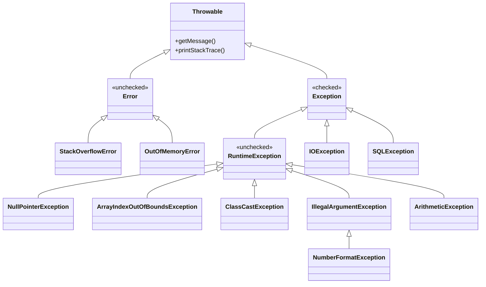
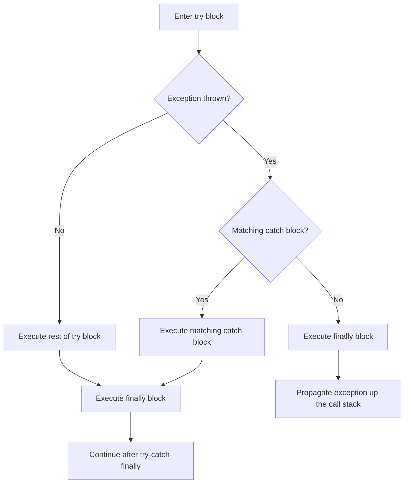

# 08 - Handling Exceptions

## Exception Hierarchy

All exceptions and errors in Java extend from `Throwable`. The hierarchy splits into two main branches: `Error` (unrecoverable) and `Exception` (recoverable).



---

## Checked vs Unchecked Exceptions

| Type | Superclass | Must Handle/Declare? | Examples |
|---|---|---|---|
| Checked | `Exception` (not RuntimeException) | Yes -- must catch or declare with `throws` | IOException, SQLException, FileNotFoundException |
| Unchecked | `RuntimeException` | No -- optional to catch or declare | NullPointerException, ArrayIndexOutOfBoundsException |
| Error | `Error` | No -- should not catch | StackOverflowError, OutOfMemoryError |

**Key rule:** The compiler enforces handling of checked exceptions. Unchecked exceptions (RuntimeException and its subclasses) and Errors are not enforced.

---

## try-catch-finally Flow



### Basic Structure

```java
try {
    // code that may throw an exception
} catch (SpecificException e) {
    // handle specific exception
} catch (GeneralException e) {
    // handle more general exception
} finally {
    // always executes (cleanup code)
}
```

**Rules:**
- `try` must be followed by at least one `catch` or a `finally` (or both).
- Multiple `catch` blocks are allowed, but must be ordered from **most specific to most general**.
- Catching a parent exception before a child exception causes a **compile error**.
- `finally` runs regardless of whether an exception was thrown or caught.

---

## Multi-Catch Block

Java 7+ allows catching multiple unrelated exception types in a single catch block using the pipe (`|`) operator.

```java
try {
    // risky code
} catch (IOException | SQLException e) {
    // handle both types
    System.out.println(e.getMessage());
}
```

**Rules:**
- Exception types in multi-catch cannot be related (no parent-child).
- The variable `e` is implicitly `final` in a multi-catch block.

---

## try-with-resources

Java 7+ feature that automatically closes resources implementing `AutoCloseable`.

```java
try (BufferedReader br = new BufferedReader(new FileReader("file.txt"))) {
    String line = br.readLine();
} // br.close() is called automatically, even if an exception occurs
```

**Rules:**
- Resources must implement `AutoCloseable` (or `Closeable`).
- Resources are closed in **reverse** order of declaration.
- Resources are closed **before** the `catch` and `finally` blocks execute.
- The `catch` and `finally` blocks are optional with try-with-resources.
- Resource variables are implicitly `final`.

---

## `throws` vs `throw`

| Keyword | Purpose | Usage |
|---|---|---|
| `throws` | Declares that a method **may** throw an exception | Method signature: `void read() throws IOException` |
| `throw` | Actually **throws** an exception object | Inside method body: `throw new IOException("error")` |

```java
public void validate(int age) throws IllegalArgumentException {
    if (age < 0) {
        throw new IllegalArgumentException("Age cannot be negative");
    }
}
```

---

## Common Exception Classes

| Exception | When It Occurs |
|---|---|
| `NullPointerException` | Calling a method or accessing a field on a `null` reference |
| `ArrayIndexOutOfBoundsException` | Accessing an array with an invalid index |
| `ClassCastException` | Invalid cast between incompatible types |
| `IllegalArgumentException` | Method receives an argument it cannot handle |
| `NumberFormatException` | Parsing a String to a number fails (subclass of IllegalArgumentException) |
| `ArithmeticException` | Illegal arithmetic operation (e.g., integer division by zero) |
| `StackOverflowError` | Infinite recursion exhausts the call stack |
| `StringIndexOutOfBoundsException` | Invalid index on a String method like `charAt()` |

---

## Custom Exceptions

Create custom exceptions by extending `Exception` (checked) or `RuntimeException` (unchecked).

```java
// Checked custom exception
public class InsufficientFundsException extends Exception {
    private double amount;

    public InsufficientFundsException(String message, double amount) {
        super(message);
        this.amount = amount;
    }

    public double getAmount() { return amount; }
}

// Unchecked custom exception
public class InvalidConfigException extends RuntimeException {
    public InvalidConfigException(String message) {
        super(message);
    }
}
```

---

## Exception Propagation

When an exception is thrown and not caught in the current method, it propagates **up the call stack** to the calling method. This continues until either:

1. A matching `catch` block is found, or
2. The exception reaches `main()` and the program terminates.

```java
public void methodA() {
    methodB();           // exception propagates here if not caught in methodB
}

public void methodB() {
    methodC();           // exception propagates here if not caught in methodC
}

public void methodC() {
    throw new RuntimeException("error");  // exception originates here
}
```

For checked exceptions, every method in the propagation chain must either catch the exception or declare it with `throws`.

---

## Exam Traps

### 1. `finally` Always Runs

The `finally` block executes in almost all scenarios:

- After `try` completes normally
- After a `catch` block handles an exception
- Even if `try` or `catch` contains a `return` statement

**The one exception:** `System.exit()` terminates the JVM immediately, preventing `finally` from running.

```java
try {
    System.exit(0);      // JVM shuts down
} finally {
    System.out.println("This never prints");
}
```

### 2. Return Values and `finally`

If both `try` (or `catch`) and `finally` contain `return` statements, the `finally` return **overrides** the previous one.

```java
public int getValue() {
    try {
        return 1;
    } finally {
        return 2;     // this is what actually gets returned
    }
}
// Returns 2
```

### 3. Catch Order Matters

Catch blocks are evaluated **top to bottom**. A parent exception type before a child causes a compile error.

```java
// COMPILE ERROR
try {
    // code
} catch (Exception e) {        // too general -- catches everything
} catch (IOException e) {      // unreachable -- compile error
}

// CORRECT
try {
    // code
} catch (IOException e) {      // specific first
} catch (Exception e) {        // general last
}
```

### 4. Unreachable Catch Blocks

If the `try` block cannot possibly throw a checked exception, catching it is a **compile error** (this rule applies only to checked exceptions, not unchecked).

```java
try {
    int x = 10;
} catch (IOException e) {     // compile error -- nothing throws IOException
}
```

---

## Source Code References

| Topic | File |
|---|---|
| Exception handling examples | [`ExceptionHandling.java`](../com/oca/exceptions/ExceptionHandling.java) |
| Custom exceptions | [`CustomException.java`](../com/oca/exceptions/CustomException.java) |
